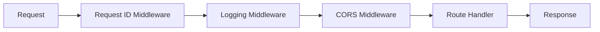

# Application Core Package

## Overview
This package contains the core FastAPI application for the E-commerce AI Assistant, which translates natural language queries into SQL and retrieves data from BigQuery across multiple e-commerce platforms.

## Directory Structure
```
app/
├── __init__.py          # Package initialization and version info
├── main.py             # FastAPI application and server setup
└── config/             # Configuration management
    ├── __init__.py
    ├── settings.py     # Environment and application settings
    └── constants.py    # Application constants and templates
```

## Components

### Main Application (`main.py`)
The FastAPI application entry point with middleware, error handlers, and core routes.

#### Features:
- Request/Response lifecycle management
- Middleware configuration
- Error handling
- Health monitoring
- BigQuery connectivity
- Debug endpoints (non-production)

```python
# Example: Starting the application
uvicorn app.main:app --host 0.0.0.0 --port 8080 --workers 4
```

### Configuration (`config/`)
Manages application settings and constants.

```python
from app.config import settings

# Access settings
print(settings.PROJECT_ID)
print(settings.BIGQUERY_DATASET)
```

## Key Features

### 1. Request Processing Pipeline


### 2. Health Monitoring
```python
# Health check endpoint
GET /health

Response:
{
    "status": "healthy",
    "environment": "production",
    "version": "1.0.0",
    "bigquery_status": "connected"
}
```

### 3. Error Handling
```python
try:
    # Application logic
except Exception as e:
    return JSONResponse(
        status_code=500,
        content={
            "error": "Internal server error",
            "detail": str(e) if settings.DEBUG else "An unexpected error occurred"
        }
    )
```

## Usage

### 1. Development Setup
```bash
# Set up environment
cp .env.example .env
# Edit .env with your settings

# Install dependencies
pip install -r requirements.txt

# Run development server
uvicorn app.main:app --reload
```

### 2. Production Deployment
```bash
# Set production environment
export ENVIRONMENT=production

# Run with multiple workers
uvicorn app.main:app --workers 4 --host 0.0.0.0 --port 8080
```

### 3. Configuration
```env
# Required environment variables
PROJECT_ID=your-project-id
BIGQUERY_DATASET=your-dataset
ANTHROPIC_API_KEY=your-api-key
```

## API Documentation
When running in non-production mode, API documentation is available at:
- Swagger UI: `/docs`
- ReDoc: `/redoc`

## Middleware

### 1. Request ID Tracking
Adds unique identifier to each request:
```python
X-Request-ID: <unique-id>
```

### 2. Logging
Structured logging for all requests:
```json
{
    "timestamp": "2024-03-21T10:00:00Z",
    "level": "INFO",
    "event": "Request processed",
    "method": "POST",
    "path": "/api/v1/query",
    "duration": "0.123s"
}
```

### 3. CORS
Configurable CORS settings:
```python
ALLOWED_ORIGINS=["http://localhost:3000"]
```

## Development Features

### Debug Endpoints (Non-production)
```python
GET /debug/config

Response:
{
    "environment": "development",
    "debug": true,
    "available_platforms": ["shopify", "amazon", "ebay"],
    "project_id": "your-project-id",
    "dataset": "your-dataset"
}
```

## Best Practices

### 1. Error Handling
- Use appropriate HTTP status codes
- Provide meaningful error messages
- Log errors with context
- Hide sensitive information in production

### 2. Configuration
- Use environment variables for configuration
- Never commit sensitive data
- Validate settings on startup
- Use type hints

### 3. Logging
- Use structured logging
- Include request context
- Log appropriate detail level
- Monitor performance metrics

## Testing
```bash
# Run tests
pytest tests/app/

# Test coverage
pytest --cov=app tests/
```

## Monitoring

### Health Checks
Regular health checks should verify:
- BigQuery connectivity
- API endpoints
- Resource availability

### Metrics
Monitor key metrics:
- Request duration
- Error rates
- Query performance
- Resource usage

## Security Notes
- API authentication required
- Rate limiting enabled
- Input validation
- Output sanitization
- Error message sanitization in production

## Contributing
When adding new features:
1. Follow existing patterns
2. Add appropriate tests
3. Update documentation
4. Follow type hints
5. Add logging statements

## Future Enhancements
- [ ] Add request tracing
- [ ] Enhance monitoring
- [ ] Add caching layer
- [ ] Implement rate limiting
- [ ] Add metric collection