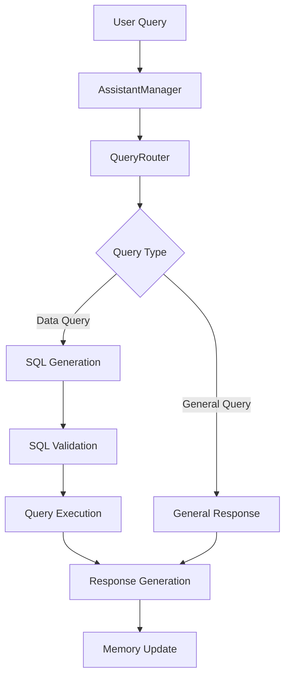

# AI Assistant Core Module

## Overview
The core assistant module handles the central logic for processing natural language queries, managing conversations, and coordinating between different components of the system to generate SQL and responses.

## Components

### AssistantManager (`base.py`)
Main coordinator that manages the entire query processing flow.

```python
from core.assistant import AssistantManager

# Initialize
assistant = AssistantManager()
await assistant.initialize()

# Process message
response = await assistant.process_message(
    message="What were my total sales last month?",
    conversation_id="conv_123",
    active_platforms={"shopify", "amazon"},
    context={"timezone": "UTC"}
)
```

### ConversationMemory (`memory.py`)
Manages conversation history and context.

```python
from core.assistant import ConversationMemory

memory = ConversationMemory()

# Add message
memory.add_message(
    conversation_id="conv_123",
    role="user",
    content="What were my sales last month?"
)

# Get history
history = memory.get_history("conv_123")
```

### QueryRouter (`router.py`)
Routes and classifies queries based on intent and required data sources.

```python
from core.assistant import QueryRouter

router = QueryRouter()
query_type, context = await router.classify_query(
    "Show me sales from last month"
)
```

## Flow Diagram



## Query Processing Pipeline

### 1. Initial Processing
```python
# In AssistantManager
async def process_message(self, message: str, conversation_id: str):
    # Update memory
    self.memory.add_message(conversation_id, "user", message)
    
    # Classify query
    query_type = await self.query_router.classify_query(message)
    
    # Process based on type
    if query_type:
        return await self._handle_data_query(...)
    else:
        return await self._handle_general_query(...)
```

### 2. Data Query Handling
```python
async def _handle_data_query(self, message: str, query_type: str):
    # Generate SQL
    sql_query = await self.sql_generator.generate_query(...)
    
    # Execute query
    results = await self.bq_client.execute_query(sql_query)
    
    # Generate response
    return await self._generate_response(results)
```

## Memory Management

### Conversation History
```python
# Add messages
memory.add_message(
    conversation_id="conv_123",
    role="user",
    content="Show me sales trends"
)

# Get context
context = memory.get_context("conv_123")
```

### State Management
```python
# Save state
memory.save_state("conversations.json")

# Load state
memory.load_state("conversations.json")
```

## Query Classification

### Query Types
- `sales`: Sales and revenue queries
- `inventory`: Product and stock queries
- `customers`: Customer-related queries
- `performance`: Performance metrics queries

### Classification Patterns
```python
query_patterns = {
    "sales": [
        r"sales",
        r"revenue",
        r"earnings",
        r"transactions"
    ],
    "inventory": [
        r"inventory",
        r"stock",
        r"products"
    ]
}
```

## Platform Support

### Platform Validation
```python
# Validate platforms
valid_platforms, invalid_platforms = await router.validate_platforms(
    requested_platforms={"shopify", "amazon"}
)
```

### Platform Capabilities
```python
# Get platform capabilities
capabilities = await router.get_platform_capabilities("shopify")
```

## Response Generation

### Data Query Response
```python
async def _generate_response(self, results):
    if not results:
        return "I found no data matching your query."
    
    template = self.schema_registry.get_response_template(query_type)
    formatted_results = self._format_results(results)
    return template.format(**formatted_results)
```

## Usage Examples

### 1. Basic Query Processing
```python
# Initialize components
assistant = AssistantManager()
await assistant.initialize()

# Process query
response = await assistant.process_message(
    message="Show me sales from last month",
    conversation_id="conv_123",
    active_platforms={"shopify", "amazon"}
)
```

### 2. Memory Usage
```python
# Get conversation summary
summary = assistant.memory.get_summary("conv_123")

# Clear old conversations
assistant.memory.clear_history(
    conversation_id="conv_123",
    older_than=timedelta(days=30)
)
```

### 3. Platform Handling
```python
# Validate platforms
is_supported, error = await router.validate_query_support(
    query_type="sales",
    platforms={"shopify", "amazon"}
)
```

## Error Handling

### Common Errors
1. Invalid Query Type
```python
if not router.supports_query_type(query_type):
    raise ValueError(f"Unsupported query type: {query_type}")
```

2. Platform Validation
```python
valid, invalid = await router.validate_platforms(platforms)
if invalid:
    raise ValueError(f"Invalid platforms: {invalid}")
```

## Configuration

### Environment Variables
```env
MAX_HISTORY=10
SCHEMA_REFRESH_INTERVAL=3600
MEMORY_SAVE_PATH=/path/to/memory
```

## Best Practices

### 1. Memory Management
- Regularly clear old conversations
- Save state periodically
- Limit conversation history size

### 2. Query Processing
- Validate platforms before processing
- Use parameterized queries
- Handle timeouts appropriately

### 3. Error Handling
- Log all errors with context
- Provide clear error messages
- Handle timeouts and retries

## Future Improvements
- [ ] Enhanced query classification
- [ ] Context-aware response generation
- [ ] Advanced memory management
- [ ] Multi-language support
- [ ] Query optimization suggestions
- [ ] Response templates customization
- [ ] Conversation analytics

## Contributing
When adding features:
1. Update relevant components
2. Add appropriate tests
3. Update documentation
4. Follow error handling patterns
5. Maintain backwards compatibility

## Testing
```bash
# Run assistant tests
pytest tests/core/assistant/

# Test specific components
pytest tests/core/assistant/test_router.py
pytest tests/core/assistant/test_memory.py
```