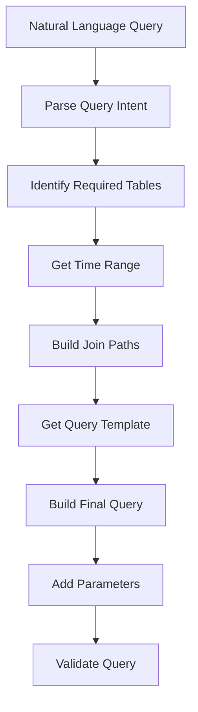

# SQL Processing Module

## Overview
This module handles SQL query generation and validation, converting natural language queries into SQL using schema metadata and validating queries for security and correctness.

## Components

### SQL Generator (`generator.py`)
Converts natural language queries into SQL:
- Uses schema metadata
- Supports multiple platforms
- Handles temporal queries
- Manages query parameters

```python
from core.sql import SQLGenerator
from core.metadata import SchemaRegistry

# Initialize
registry = SchemaRegistry()
await registry.initialize()
generator = SQLGenerator(registry)

# Generate query
query, params, tables = await generator.generate_query(
    text="What were my total sales last month?",
    platforms={"shopify", "amazon"},
    query_type="sales"
)
```

### SQL Validator (`validator.py`)
Validates SQL queries for:
- Security risks
- Schema compliance
- Query structure
- Parameter validation

```python
from core.sql import SQLValidator

validator = SQLValidator(registry)
is_valid, error = await validator.validate_query(query, params)
```

## Query Generation Flow



## Sample Queries

### 1. Sales Analysis
```python
# Query: "Show me total sales by platform for last month"
# Generated SQL:
"""
SELECT 
    platform,
    COUNT(DISTINCT order_id) as order_count,
    SUM(total_amount) as total_sales
FROM `project.dataset.consolidated_orders`
WHERE order_date BETWEEN @start_date AND @end_date
GROUP BY platform
"""
```

### 2. Product Analysis
```python
# Query: "What are my top selling products?"
# Generated SQL:
"""
SELECT 
    p.product_name,
    COUNT(DISTINCT o.order_id) as order_count,
    SUM(oi.quantity) as units_sold,
    SUM(oi.total_amount) as revenue
FROM `project.dataset.consolidated_orders` o
JOIN `project.dataset.order_items` oi ON o.order_id = oi.order_id
JOIN `project.dataset.products` p ON oi.product_id = p.product_id
WHERE o.order_date BETWEEN @start_date AND @end_date
GROUP BY p.product_id, p.product_name
ORDER BY revenue DESC
LIMIT 10
"""
```

## Validation Process

### 1. Security Validation
```python
# Check for SQL injection risks
patterns = [
    r';\s*DROP\s+',
    r';\s*DELETE\s+',
    r'UNION\s+SELECT'
]
```

### 2. Schema Validation
```python
# Validate table references
for table in tables:
    if not registry.table_exists(table):
        raise ValueError(f"Invalid table: {table}")
```

### 3. Query Structure
```python
# Example structure validation
def _validate_query_structure(self, query: str) -> bool:
    # Must have SELECT
    if not re.search(r'^\s*SELECT', query, re.IGNORECASE):
        return False
    
    # Must have FROM
    if not re.search(r'\sFROM\s', query, re.IGNORECASE):
        return False
    
    return True
```

## Using with Different Platforms

### Platform-Specific Tables
```yaml
# Schema: shopify/orders.yaml
table_name: shopify_orders
columns:
  - name: order_id
    type: STRING
    business_term: "Order ID"
  - name: created_at
    type: TIMESTAMP
    business_term: "Order Date"
```

### Consolidated Tables
```yaml
# Schema: consolidated/orders.yaml
table_name: consolidated_orders
columns:
  - name: order_id
    type: STRING
  - name: platform
    type: STRING
    enums: ["shopify", "amazon", "ebay"]
  - name: order_date
    type: TIMESTAMP
```

## Best Practices

### 1. Query Generation
```python
# Always use parameterized queries
query = """
SELECT *
FROM `{project}.{dataset}.{table}`
WHERE date BETWEEN @start_date AND @end_date
  AND platform IN UNNEST(@platforms)
"""

# Never string concatenation
# BAD: query = f"... WHERE date = '{date}'"
```

### 2. Table References
```python
# Always use fully qualified names
table_ref = f"`{project_id}.{dataset}.{table}`"

# Include platform filtering when needed
if platforms:
    query += "AND platform IN UNNEST(@platforms)"
```

### 3. Error Handling
```python
try:
    query, params = await generator.generate_query(text, platforms)
except ValueError as e:
    logger.error("Invalid query input", error=str(e))
except Exception as e:
    logger.error("Query generation failed", error=str(e))
```

### 4. Validation
```python
# Always validate before execution
is_valid, error = await validator.validate_query(query, params)
if not is_valid:
    raise ValueError(f"Invalid query: {error}")
```

## Performance Considerations

### 1. Query Optimization
```sql
-- Use appropriate filters
WHERE date >= @start_date
  AND platform IN UNNEST(@platforms)

-- Limit result sets
LIMIT @limit

-- Use column pruning
SELECT specific_columns
FROM table
```

### 2. Join Optimization
```sql
-- Use proper join types
INNER JOIN when possible
LEFT JOIN when needed

-- Join order matters
FROM smallest_table
JOIN larger_table
JOIN largest_table
```

## Common Patterns

### 1. Time-Based Queries
```python
time_patterns = {
    "last_month": lambda now: (
        now.replace(day=1) - timedelta(days=1),
        now.replace(day=1)
    ),
    "this_year": lambda now: (
        now.replace(month=1, day=1),
        now
    )
}
```

### 2. Platform Handling
```python
platform_configs = {
    "shopify": {
        "date_field": "created_at",
        "amount_field": "total_price"
    },
    "amazon": {
        "date_field": "purchase_date",
        "amount_field": "order_total"
    }
}
```

## Testing

### 1. Generator Tests
```python
def test_generate_sales_query():
    query, params, tables = await generator.generate_query(
        "Show me sales from last month",
        platforms={"shopify"}
    )
    assert "SELECT" in query
    assert "total_amount" in query
    assert "consolidated_orders" in tables
```

### 2. Validator Tests
```python
def test_validate_query():
    is_valid, error = await validator.validate_query(
        "SELECT * FROM `project.dataset.table`"
    )
    assert is_valid
    assert error is None
```

## Error Handling

### 1. Generator Errors
```python
class QueryGenerationError(Exception):
    def __init__(self, message: str, query_text: str):
        self.message = message
        self.query_text = query_text
        super().__init__(self.message)
```

### 2. Validation Errors
```python
class ValidationError(Exception):
    def __init__(self, message: str, query: str):
        self.message = message
        self.query = query
        super().__init__(self.message)
```

## Future Enhancements
- [ ] Query cost estimation
- [ ] Advanced query optimization
- [ ] Query plan analysis
- [ ] Query caching
- [ ] Performance metrics collection
- [ ] Enhanced time parsing
- [ ] Custom template support
- [ ] Query plan visualization

## Contributing
When adding new features:
1. Update schema definitions
2. Add appropriate tests
3. Document query patterns
4. Follow security practices
5. Include error handling
6. Add logging statements
7. Update documentation

## Dependencies
- google-cloud-bigquery
- networkx (for schema relationships)
- pyyaml (for schema loading)
- structlog (for logging)